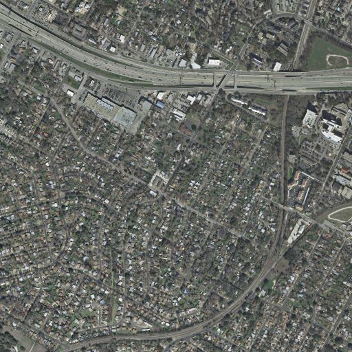
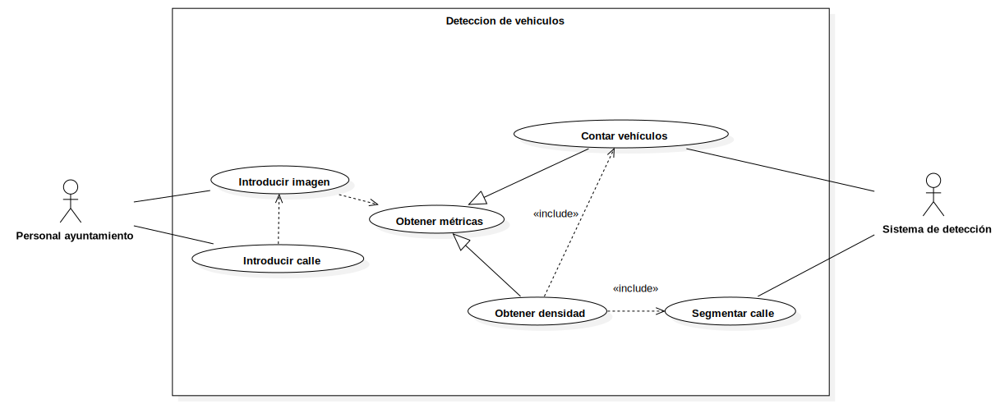

# AIVA_2022-ImagenesAereas
Repositorio para la práctica de la asignatura aplicaciones industriales y comerciales consistente en el reconocimiento de imágenes aéreas

El objetivo de este producto es desarrollar el sistema TrafficDetector, que es capaz de contar los vehículos que aparecen en una imagen. Dada una imagen aérea, se podrá visualizar un mapa de calor del flujo del tráfico.
También es posible introducir el nombre de una calle y de esta manera obtener el número de vehículos que aparecen en esa calle concreta, siempre que la calle aparezca en la imagen.
Las imágenes con las que se trabaja tienen esta apariencia:

<p>
   </p>

Este es un posible caso de uso de la aplicación:

<p>
   </p>

Este repositorio cuenta con:
* Un directorio ```documents``` donde se pueden ver los documentos que hemos desarrollado para este proyecto.
* Un directorio ```test``` donde se encuentran los tests automáticos que utilizaremos para comprobar que el sistema realiza sus funciones correctamente.
